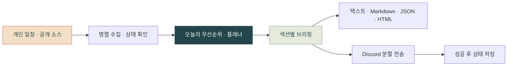

<p align="center">
  
</p>

<p align="center">
  <strong>오늘 챙길 일부터 세상 소식까지, Discord로.</strong><br />
  일정·마감·날씨를 먼저 확인하고, 뉴스와 관심 분야를 이어 읽는 개인 아침 브리핑 봇입니다.
</p>

<p align="center">
  <a href="https://github.com/seopseopi/daily-brief-bot/actions/workflows/ci.yml"></a>
  <a href="https://github.com/seopseopi/daily-brief-bot/actions/workflows/morning.yml"></a>
  
  
</p>

<p align="center">
  <a href="#바로-실행"><strong>바로 실행</strong></a>
  &nbsp; · &nbsp; <a href="docs/preview.md">브리핑 예시</a>
  &nbsp; · &nbsp; <a href="docs/configuration.md">설정 안내</a>
  &nbsp; · &nbsp; <a href="docs/operations.md">운영·문제 해결</a>
  &nbsp; · &nbsp; <a href="docs/architecture.md">코드 구조</a>
</p>

<p align="center"><sub>배너는 브랜드 일러스트입니다. 브리핑 예시는 가상 데이터이며 개인 일정과 실제 조회 결과를 포함하지 않습니다.</sub></p>

## 하루를 시작하는 순서대로

여러 앱을 열어 오늘 일정을 찾고 마감을 세는 일을 한 번의 브리핑으로 모읍니다. 먼저 행동할 일을 읽고, 필요한 소식의 원문까지 이어갈 수 있도록 구성했습니다.

| 먼저 확인할 것 | 브리핑에서 할 수 있는 일 |
| :--- | :--- |
| **핵심 3줄** | 일정 상태·임박한 마감·다음 일정·날씨 중 우선 확인할 내용을 먼저 읽기 |
| **오늘의 플래너** | 겹친 일정, 남은 빈 시간, 가까운 마감을 확인해 하루 계획 세우기 |
| **날씨·대기질** | 현재·일별 예보와 시간대별 변화를 보고 우산·외출 준비 판단하기 |
| **일정·과제** | 개인 캘린더와 고정 시간표를 함께 보기, Discord에서 과제 추가·완료하기 |
| **시사·학사공지** | 최근 기사와 새 공지를 매체·발행시각·원문 링크로 확인하기 |
| **관심 분야** | 시장·스포츠·논문·커뮤니티를 골라 읽고 간결한 모드로 분량 줄이기 |

핵심 내용은 규칙으로 선정합니다. **미연결·조회 실패·정상 0건을 구분**하고, 발행시각 없는 기사는 최근 뉴스에 섞지 않습니다. 커뮤니티는 사실 보도와 구별하며, 상세 기준은 [데이터 소스와 표시 원칙](docs/sources.md)에 정리했습니다.

## 바로 실행

**Python 3.12**를 권장합니다. 첫 데모는 API 키·Discord 설정·외부 데이터 요청 없이 실행할 수 있습니다.

```bash
git clone https://github.com/seopseopi/daily-brief-bot.git
cd daily-brief-bot
python3 -m venv .venv
source .venv/bin/activate
python -m pip install -r requirements.txt
python main.py --demo
```

### 미리보기와 설정 확인

```bash
# 가상 데이터로 브리핑을 HTML 파일로 저장
python main.py --demo --format html --output /tmp/morning-brief-demo.html

# 설정 존재 여부 점검 — 비밀값을 출력하거나 외부 연결을 요청하지 않음
python main.py --doctor

# 실제 데이터 소스 연결 점검 — 수집 내용 없이 상태만 출력
python main.py --check-connections --sections weather,schedule,news

# 연결한 실제 소스를 조회하되 Discord 전송·상태 저장 없이 미리보기
python main.py --preview --sections weather,schedule,news --compact
```

`--preview`는 설정한 외부 소스와 필요한 AI API를 호출할 수 있습니다. 개인 데이터가 포함될 수 있는 결과물은 공개 저장소에 넣지 마세요. `--demo`는 포함된 가상 데이터만 사용합니다.

| 옵션 | 용도 |
| :--- | :--- |
| `--demo` | 네트워크 없는 공개 가상 샘플 |
| `--preview` | 실제 수집 결과를 읽기 전용으로 확인 |
| `--format text\|markdown\|json\|html` | 미리보기 출력 형식. 기본 `text` |
| `--output 경로` | 데모·미리보기 결과를 파일로 저장 |
| `--sections weather,schedule,news` | 이번 실행에서 볼 섹션 선택 |
| `--compact` | 핵심 내용을 중심으로 분량 줄이기 |
| `--doctor` | 설정값의 존재 여부와 형식 확인 |
| `--check-connections` | 실제 소스 수집 상태 확인. 전송·상태 저장 없이 `text` 또는 `json`으로 출력 |

### Discord로 받기

GitHub Actions에 `DISCORD_WEBHOOK_URL` Secret을 등록합니다. 개인 캘린더, 과제 채널, 위치와 관심 종목은 [설정 안내](docs/configuration.md)를 따라 연결하세요. 로컬 실제 전송은 웹후크 환경 변수를 설정한 뒤 `python main.py`로 실행합니다.

예약은 **KST 07:30·07:40·07:50**의 실행 기회 중 첫 성공을 기록해 후속 예약 중복을 막습니다. GitHub Actions는 정시 도착을 보장하지 않으며, 여러 메시지 전송 또는 상태 저장 중 실패하면 재실행 시 중복될 수 있습니다. [예약·재시도 동작](docs/operations.md#예약-발송)

## 구성과 검증



```text
daily-brief-bot/
├── main.py               # 기존 실행 진입점
├── briefing/             # 수집 · 플래너 · 출력 · CLI · 공개 데모
├── sources/              # 캘린더·과제·날씨와 각 외부 소스 어댑터
├── discord_sender.py     # 메시지 제한 · 분할 · 재시도
├── settings.py           # 환경 변수와 개인 설정
├── tests/                # 날짜·소스·전송·운영 회귀 테스트
├── data/                 # 공개 공지 ID · 예약 전송 날짜
└── docs/                 # 설정 · 운영 · 구조 · 공개 브리핑 예시
```

```bash
python -m unittest discover -s tests -v
```

테스트는 외부 응답을 대체해 실패·경계 상황과 읽기 전용 실행을 확인합니다. 실제 서비스의 현재 응답과 Discord 도착 여부는 운영 결과에서 확인해야 합니다. 개인 과제 캐시는 Git에서 제외되는 `.private/`에 저장합니다.

| 문서 | 내용 |
| :--- | :--- |
| [브리핑 예시](docs/preview.md) | 가상 데이터로 재현할 수 있는 출력 |
| [설정 안내](docs/configuration.md) | Secret·Variable, 캘린더, 과제 명령, 관심 종목 |
| [운영·문제 해결](docs/operations.md) | 예약·재시도, 상태 저장, 증상별 확인 |
| [데이터 소스](docs/sources.md) | 최신성·출처·AI 요약의 범위 |
| [코드 구조](docs/architecture.md) | 모듈의 역할과 확장 흐름 |

---

<p align="center">
  <strong>아침은 가볍게, 오늘은 선명하게.</strong><br />
  <sub>아침 브리핑 · <a href="docs/preview.md">브리핑 예시</a> · <a href="docs/assets/README.md">배너 제작 기록</a></sub>
</p>
